# Lab Exercises

## Lab 1
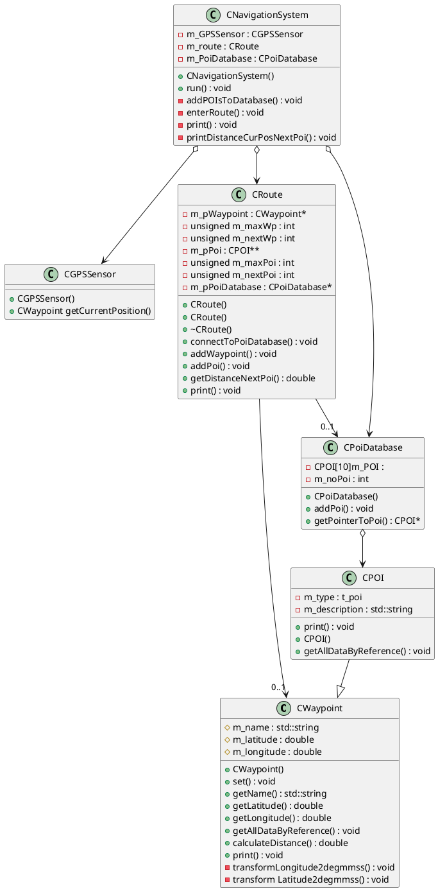
<!---->

## Lab 2

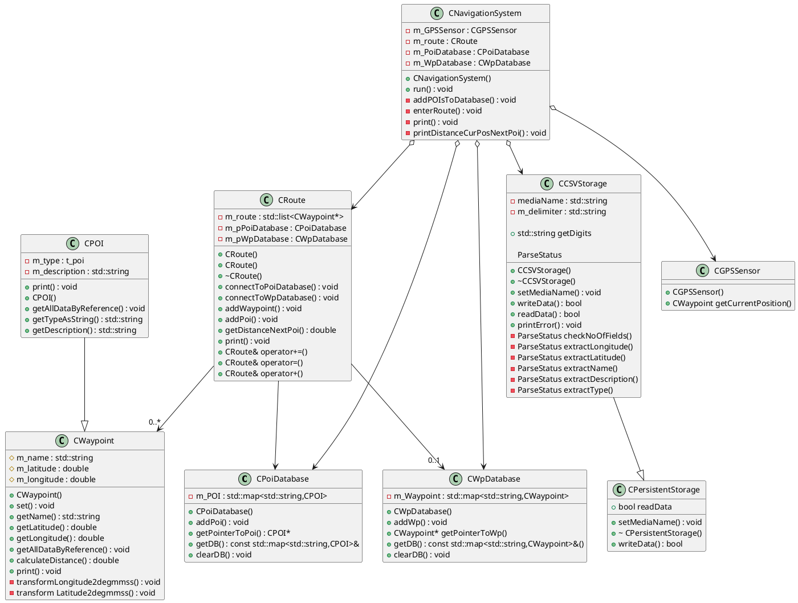


<!--/myCode/classdiagram.png)-->

## Lab 3

```plantuml
@startuml
'set namespaceSeparator ::
class CPoiDatabase {
 	+ CPoiDatabase()
 	+ ~CPoiDatabase()
}
class CWaypoint {
 	# m_name : std::string
 	# m_latitude : double
 	# m_longitude : double

 	+ CWaypoint()
 	+ ~CWaypoint()
 	+ set() : void
 	+ getName() : std::string
 	+ getLatitude() : double
 	+ getLongitude() : double
 	+ getAllDataByReference() : void
 	+ calculateDistance() : double
 	+ print() : void
 	- transformLongitude2degmmss() : void
 	- transform Latitude2degmmss() : void
}
class CPersistentStorage {
 	+ setMediaName() : void
 	+ ~ CPersistentStorage()
 	+ writeData() : bool
 	+ readData() : bool

 	MergeMode
}
class CRoute {
 	- m_route : std::list<CWaypoint*>
 	- m_pPoiDatabase : CPoiDatabase
 	- m_pWpDatabase : CWpDatabase

 	+ CRoute()
 	+ CRoute()
 	+ connectToPoiDatabase() : void
 	+ connectToWpDatabase() : void
 	+ addWaypoint() : void
 	+ addPoi() : void
 	+ getDistanceNextPoi() : double
 	+ print() : void
 	+ CRoute& operator+=()
 	+ CRoute& operator=()
 	+ CRoute& operator+()
 	+ const std::vector<const CWaypoint*> getRoute()
}
class CPOI {
 	- m_type : t_poi
 	- m_description : std::string

 	+ print() : void
 	+ CPOI()
 	+ getAllDataByReference() : void
 	+ getTypeAsString() : std::string
 	+ getDescription() : std::string
}
class CGPSSensor {
 	+ CGPSSensor()
 	+ CWaypoint getCurrentPosition()
}
class CWpDatabase {
 	+ CWpDatabase()
 	+ ~CWpDatabase()
}
class CNavigationSystem {
 	- m_GPSSensor : CGPSSensor
 	- m_route : CRoute
 	- m_PoiDatabase : CPoiDatabase
 	- m_WpDatabase : CWpDatabase

 	+ CNavigationSystem()
 	+ run() : void
 	- addPOIsToDatabase() : void
 	- enterRoute() : void
 	- print() : void
 	- printDistanceCurPosNextPoi() : void
}
class FlexLexer {
 	# char* yytext
 	# int yyleng
 	# int yylineno
 	# int yy_flex_debug

 	+ ~FlexLexer()
 	+ const char* YYText()
 	+ int YYLeng()
 	+ void yy_switch_to_buffer()
 	+ yy_crete_buffer()
 	+ void yy_delete_buffer()
 	+ yyrestart() : void
 	+ int yylex()
 	+ int yylex()
 	+ void switch_streams()
 	+ int lineno()
 	+ int debug()
 	+ void set_debug()
}
class CDatabase<typename K,typename T> {
 	- m_storage : std::map<K,T>

 	+ CDatabase()
 	+ ~CDatabase()
 	+ addElement() : void
 	+ getPointerToElement() : T* 
 	+ getDB() : std::map<K,T>&
 	+ clearDB() : void
}
class yy_buffer_state <<struct>> {
 	+ std::istream yy_input_file
 	+ char* yy_ch_buf
 	+ char* yy_buf_pos
 	+ yy_size_t yy_buf_size
 	+ yy_size_t yy_n_chars
 	+ int yy_is_our_buffer
 	+ int yy_is_interactive
 	+ int yy_at_bol
 	+ int yy_bs_lineno
 	+ int yy_bs_column
 	+ int int yy_fill_buffer
 	+ int yy_buffer_status
}
class jsonFlexLexer {
 	# int yy_start_stack_ptr
 	# int yy_start_stack_depth
 	# int* yy_start_stack
 	# std::istream* yyin
 	# std::ostream* yyout
 	# char yy_hold_char
 	# int yy_n_chars
 	# char* yy_c_buf_p
 	# int yy_init
 	# int yy_start
 	# int yy_did_buffer_switch_on_eof
 	# size_t yy_buffer_stack_top
 	# size_t yy_buffer_stack_max
 	# yy_buffer_state yy_buffer_stack
 	# yy_buffer_state

 	+ jsonFlexLexer()
 	+ ~jsonFlexLexer()
 	+ void yy_switch_to_buffer()
}
class CJsonPersistence {
 	stateType
}
class CCsvPersistence {
 	- mediaName : std::string
 	- m_delimiter : std::string

 	+ CCsvPersistence()
 	+ ~CCsvPersistence()
 	+ setMediaName() : void
 	+ writeData() : bool
 	+ readData() : bool
 	+ printError() : void
 	+ getDigits() : std::string
 	- ParseStatus checkNoOfFields()
 	- ParseStatus extractLongitude()
 	- ParseStatus extractLatitude()
 	- ParseStatus extractName()
 	- ParseStatus extractDescription()
 	- ParseStatus extractType()

 	ParseStatus
}
class APT::CJsonScanner {
 	- CJsonToken*token

 	- int yylex()
 	+ CJsonScanner()
 	+ ~CJsonScanner()
 	+ CJsonToken* nextToken()
 	+ int scannedLine()
}
class APT::CJsonToken {
 	- TokenType type

 	+ CJsonToken()
 	+ ~CJsonToken()
 	+ TokenType getType()
 	+ str() : std::string

 	TokenType
}
class APT::CJsonValueToken<typedef T> {
 	- T value

 	+ CJsonValueToken()
 	+ T getValue()
 	+ std::string str
}
class yy_trans_info {
 	+ flex_int32_t yy_verify
 	+ flex_int32_t yy_next
}

' FlexLexer ..> yy_buffer_state

' CPersistentStorage ..> CPoiDatabase
' CPersistentStorage ..> CWpDatabase

CRoute -->"0..*" CWaypoint
' CRoute ..> CPOI
CRoute -->"0..1" CWpDatabase
CRoute -->"0..1" CPoiDatabase

CNavigationSystem o--> CRoute
' CNavigationSystem ..> CPersistentStorage
' CNavigationSystem ..> CWaypoint
CNavigationSystem o--> CGPSSensor
' CNavigationSystem ..> CPOI
CNavigationSystem o--> CCsvPersistence
CNavigationSystem o--> CWpDatabase
CNavigationSystem o--> CPoiDatabase

' jsonFlexLexer ..> yy_buffer_state
jsonFlexLexer --|> FlexLexer

' CJsonPersistence ..> CDatabase
CJsonPersistence --|> CPersistentStorage
' CJsonPersistence ..> CWaypoint
' CJsonPersistence ..> CPoiDatabase
' CJsonPersistence ..> CWpDatabase
' CJsonPersistence ..> CPOI
' CJsonPersistence ..> APT::CJsonValueToken
' CJsonPersistence ..> APT::CJsonValueToken
' CJsonPersistence ..> APT::CJsonScanner

CPoiDatabase --|> CDatabase
' CPoiDatabase ..> CPOI

CWpDatabase --|> CDatabase
' CPoiDatabase ..> CWaypoint


' CCsvPersistence ..> CWpDatabase
CCsvPersistence --|> CPersistentStorage
' CCsvPersistence ..> CWaypoint

' CGPSSensor ..> CWaypoint

' CPersistentStorage ..> CPoiDatabase
' CPersistentStorage ..> CWpDatabase

CPOI --|> CWaypoint

' CCSVStorage ..> CPOI
' CCSVStorage ..> CPoiDatabase
' CCSVStorage ..> CWaypoint
CCSVStorage --|> CPersistentStorage
' CCSVStorage ..> CWpDatabase

' CWpDatabase ..> CWaypoint

APT::CJsonScanner --|> jsonFlexLexer

APT::CJsonValueToken --|> APT::CJsonToken

@enduml
```

<!--/myCode/classdiagram.png)-->

# Optional Exercises

## CCoordinate

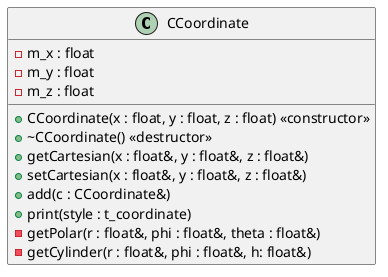

## Set of Measurement Values

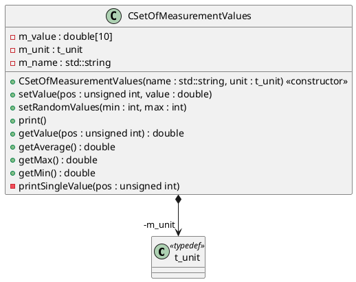

<!--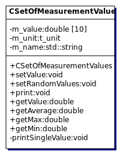-->

## CComplex

* operator overloading

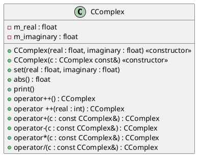

## CFraction

* operator overloading

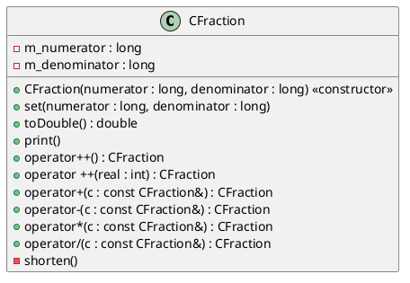

## CBank

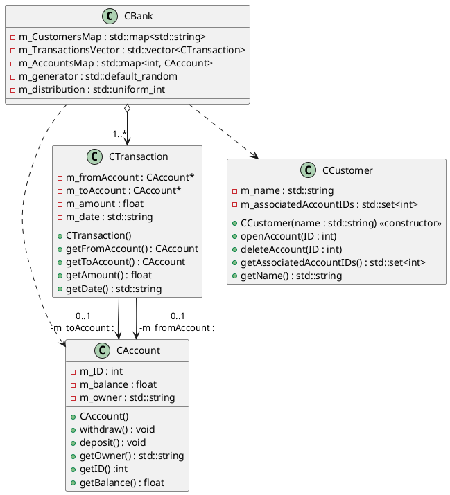
<!--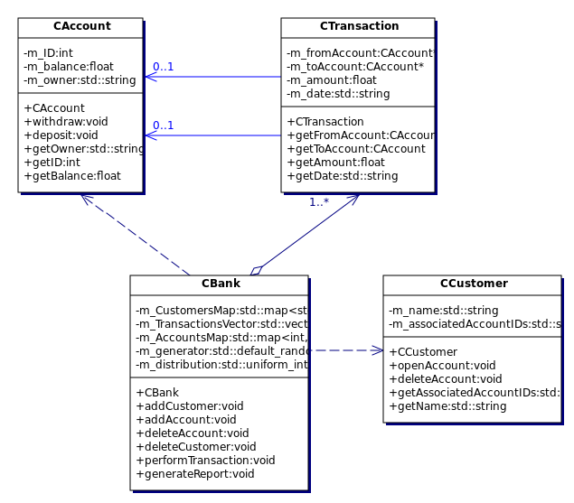-->

## CPhoneList

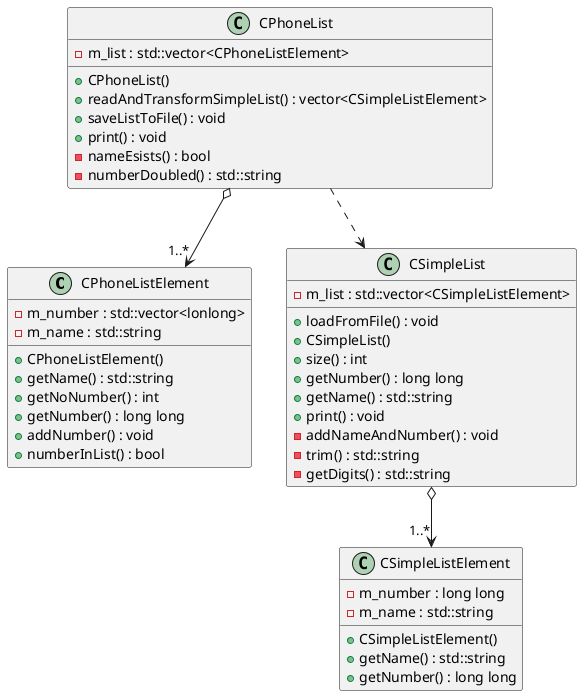

<!--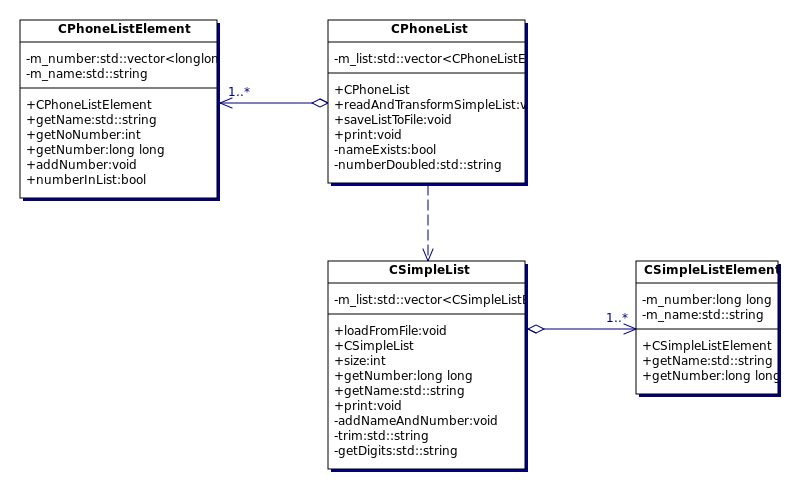-->

## CRPNCalculator

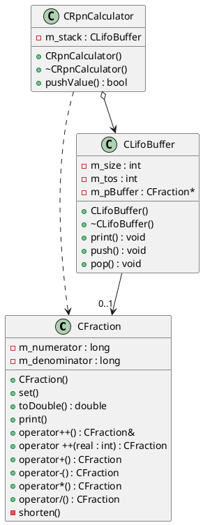

<!--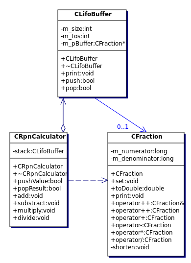-->

## CXMLParser

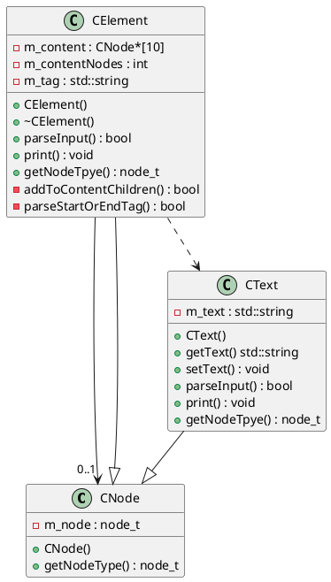

<!--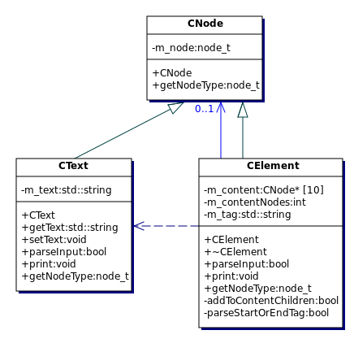-->

## CSort

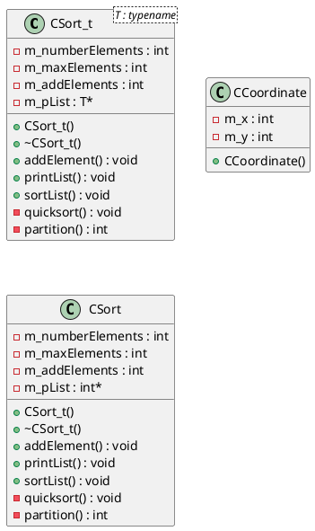

<!--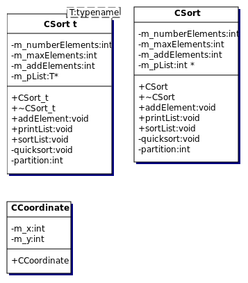-->

# Live Code

## Live Code 1

C-equivalent of classes: structs, but they can't have methods
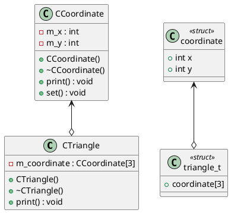

<!---->

## Live Code 2a

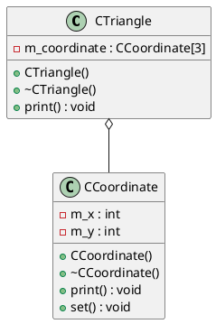

<!---->

## Live Code 2b

* getIndex(row, column) returns the array index of a matrix element
* the enum matrixInit_t  is used to specify how the matrix should be initialized
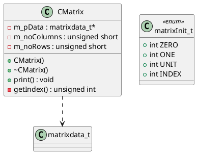

<!---->

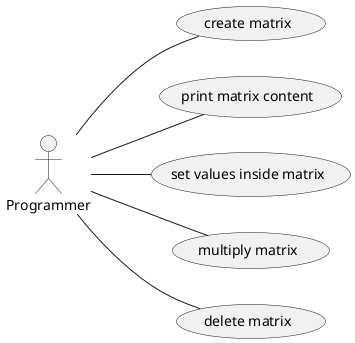

<!---->

## Live Code 3a
* added a copy constructor
* added a static variable to count the number of instances

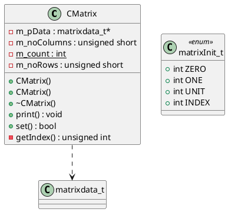

<!---->


<!---->

## Live Code 3b

* Lidar::m_pScan: aggregation by value
* Lidar::m_Cuart: association

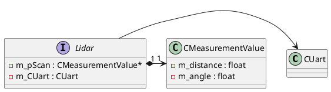

<!---->

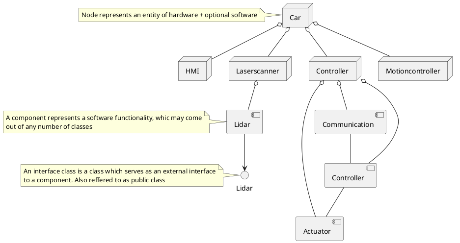

<!---->

## Live Code 3c

* typedef matrixdata_t CCoordinate
* each element is a CCoordinate: e.g. m_pData[i] = CCoordinate(0,0);

```plantuml
@startuml
class CCoordinate {
	- m_x : int
	- m_y : int

	+ CCoordinate(x:int, y:int) <<constructor>>
	+ print() : void
	+ set(x:int, y:int) : bool
}
class matrixInit_t << enum >> {
 	+ int ZERO
 	+ int ONE
 	+ int UNIT
 	+ int INDEX
}
class CMatrix {
 	- m_pData : matrixdata_t* 
 	- m_noColumns : unsigned short
 	- m_noRows : unsigned short
	- {static} m_count : int

 	+ CMatrix() <<constructor>>
	+ CMatrix() <<copy constructor>>
 	+ ~CMatrix()
 	+ print() : void
 	- getIndex() : unsigned int
}

CMatrix "1"*-->"1..*" CCoordinate
CMatrix ..> matrixInit_t

@enduml
```

<!---->

## Live Code 4

```plantuml
@startuml
left to right direction
actor Programmer
rectangle GraphicalSystem {
 	Programmer -- (Create graphical objects)
 	Programmer -- (Print the objects on a single screen)
 	(Print the objects on a single screen) .up.> (Create graphical objects) : <<include>>
 	(Print the objects on a single screen) <.down. (Print the objects on multiple screens): <<extend>>
 	Programmer -- (Move objects on the screen)

 	note right of (Create graphical objects)
 	The include relation might be a bit overengineered
 	end note
}

(Print the objects on multiple screens) <.left. (Display objects on real GUI) : <<extend>>
@enduml
```

* CGraphicObject::print() calls CCoordinate::print() for all its coordinates

```plantuml
@startuml
class CGraphicalSystem {
 	- m_database : CDatabase
 	- m_screen : CScreen

 	+ CGraphicalSystem() <<constructor>>
 	+ print() : void
}
class CDatabase {
 	- m_size : unsigned int
 	- m_nextFreeTriangle : unsigned int
	- m_circle : CCircle*
	- m_triangle : CTriangle*
	- m_rectangle : CRectangle*

 	+ CDatabase() <<constructor>>
 	+ print() : void
 	+ addElement() : bool
 	+ getAddressOfTriangle() : CTriangle* 
}
class CScreen {
 	- m_size : unsigned int
 	- m_nextFreeTriangle : unsigned int
 	- m_pTriangle : CTriangle** 
 	- m_pDatabase : CDatabase*

 	+ CScreen() <<constructor>>
 	+ connect() : void
 	+ addElement() : bool
 	+ print() : void
}
class CGraphicObject {
 	- m_name : std::string
 	- m_noCoordinates : unsigned int
 	# m_pCoordinate : CCoordinate* 

 	+ CGraphicObject() <<constructor>>
 	+ set() : bool
 	+ print() : void
 	+ move() : bool
 	+ operator=() : CGraphicObject& 
 	+ getName() : std::string
}
class CCircle {
 	- m_radius : unsigned int
 	+ CCircle() <<constructor>>
 	+ print() : void
}
class CRectangle {
 	+ CRectangle() <<constructor>>
}
class CTriangle {
 	+ CTriangle() <<constructor>>
}
class CCoordinate {
 	- m_x : int
 	- m_y : int

 	+ CCoordinate() <<constructor>>
 	+ print() : void
 	+ set() : bool
}

CGraphicalSystem *--> CDatabase
CGraphicalSystem *--> CScreen
CScreen -->"0..1" CDatabase

CDatabase ..> CTriangle
CDatabase ..> CRectangle
CDatabase ..> CCircle
CDatabase "1"*-->"0..*" CGraphicObject

CScreen o-->"0..*" CGraphicObject

CTriangle --|> CGraphicObject
CRectangle --|> CGraphicObject
CCircle --|> CGraphicObject

CGraphicObject "1"*-->"0..1" CCoordinate
@enduml
```

<!---->

## Live Code 5

* the code is the same as in 'Live Code 4', except for
	* now we can store and display more than just CTriangles
	* we delete the dynamically allocated memory in m_pObject
	* we check full null pointers prior to dereferencing
	* CDatabase::addElement() creates an instance of the desired type
	* ~CGraphicObject() deletes the created Coordinate
	* Polymorphism: make CGraphicObject's methods virtual
	* constructor of derived object first call the superclass' constructor via the intializer list
	* added error messages to CScreen::addElement() in case the object wasn't found in the database or the static array is full
* similar to Lab 1: CGraphicObjects are stored in (i.e. memory is provided by) CDatabase
* CScreen stores a pointer to the CDatabase instance
* CScreen::addElement() calls CDatabase::getAddressOfObject() and stores the CGraphicObject's address in m_pObject

```plantuml
@startuml
class CGraphicalSystem {
 	- m_database : CDatabase
 	- m_screen : CScreen

 	+ CGraphicalSystem() <<constructor>>
 	+ print() : void
}
class CDatabase {
 	- unsigned m_size : int
 	- unsigned m_nextFreeObject : int
 	- m_pObject : CGraphicObject** 

 	+ CDatabase() <<constructor>>
 	+ ~CDatabase() <<destructor>>
 	+ print() : void
 	+ addElement() : bool
 	+ CGraphicObject* getAddressOfObject()
}
class CScreen {
 	- unsigned m_size : int
 	- unsigned m_nextFreeObject : int
 	- m_pObject : CGraphicObject** 
 	- m_pDatabase : CDatabase

 	+ CScreen() <<constructor>>
 	+ ~CScreen() <<destructor>>
 	+ connect() : void
 	+ addElement() : bool
 	+ print() : void
}
class CGraphicObject {
 	- m_name : std::string
 	- unsigned m_noCoordinates : int
 	# m_pCoordinate : CCoordinate* 

 	+ CGraphicObject() <<constructor>>
 	+ ~CGraphicObject() <<destructor>>
 	+ set() : bool
 	+ void print
 	+ bool move
 	+ CGraphicObject& operator=
 	+ getName() : std::string
}
class CCircle {
 	- m_radius : unsigned int

 	+ CCircle() <<constructor>>
 	+ print() : void
}
class CRectangle {
 	+ CRectangle() <<constructor>>
}
class CTriangle {
 	+ CTriangle() <<constructor>>
}
class CCoordinate {
 	- m_x : int
 	- m_y : int

 	+ CCoordinate() <<constructor>>
 	+ print() : void
 	+ set() : bool
}

CGraphicalSystem *--> CDatabase
CGraphicalSystem *--> CScreen
CScreen -->"0..1" CDatabase

CDatabase ..> CTriangle
CDatabase ..> CRectangle
CDatabase ..> CCircle
CDatabase "1"*-->"0..*" CGraphicObject

CScreen o-->"0..*" CGraphicObject

CTriangle --|> CGraphicObject
CRectangle --|> CGraphicObject
CCircle --|> CGraphicObject

CGraphicObject "1"*-->"0..1" CCoordinate
@enduml
```

<!---->

```plantuml
@startuml
left to right direction
actor Programmer
rectangle GraphicalSystem {
 	Programmer -- (Create graphical objects)
 	Programmer -- (Print the objects on a single screen)
 	(Print the objects on a single screen) .up.> (Create graphical objects) : <<include>>
 	(Print the objects on a single screen) <.down. (Print the objects on multiple screens): <<extend>>
 	Programmer -- (Move objects on the screen)

 	note right of (Create graphical objects)
 	The include relation might be a bit overengineered
 	end note
}

(Print the objects on multiple screens) <.left. (Display objects on real GUI) : <<extend>>
@enduml
```

<!---->

```plantuml
@startuml
class CCircle {
 	-m_radius : unsigned int

 	+ CCircle() <<constructor>>
 	+ print() : void
}
class CRectangle {
 	+ CRectangle() <<constructor>>
}
class CTriangle {
 	+ CTriangle() <<constructor>>
}
class CGraphicObject {
 	- m_name : std::string
 	- unsigned m_noCoordinates : int
 	# m_pCoordinate : CCoordinate* 

 	+ CGraphicObject() <<constructor>>
 	+ ~CGraphicObject()
 	+ set() : bool
 	+ void print
 	+ bool move
 	+ CGraphicObject& operator=
 	+ getName() : std::string
}
class CCoordinate {
 	- m_x : int
 	- m_y : int

 	+ CCoordinate() <<constructor>>
 	+ print() : void
 	+ set() : bool 	
}

CCircle --|> CGraphicObject
CRectangle --|> CGraphicObject
CTriangle --|> CGraphicObject

CCircle ..> CCoordinate
CTriangle ..> CCoordinate

CGraphicObject "1"*-->"1..*" CCoordinate

note left of CCircle: Inheritance\nA circle "is" a graphical object

@enduml
```

<!---->

## Live Code 6a

```plantuml
@startuml
left to right direction
Captain -- (Navigate the boat)
Captain -- (Enter and leave the boat)
Sailor -- (Enter and leave the boat)
Sailor -- (Raise sails)
Boat -- (Sail the vast sea)

(Create Boat, Captain, Sailor objects) -- :Simulation user:
(Choose boat and have crew enter the boat) -- :Simulation user:
(Have captain navigate) -- :Simulation user:
(Have crew set the sails) -- :Simulation user:

@enduml
```

* Polymophism: CSailingSimulator could store an array of pointers of type CBoat pointing to instances of CLongboat, CDinghy and CCruiser, but for that, these methods would need to be virtual in CBoat

```plantuml
@startuml
class CBoat {
	- m_speed : int
	- m_course : int
	- m_maxSpeed : int

	+ command() : void
	+ sail() : void
	+ leaveBoat() : void
	+ enterBoat() : void
}
class CLongboat
class CDinghy
class CCruiser
class CPerson {
	- m_age : int
	- m_name : std::string
}
class CSailingSimulator
class CSailor {
	+ raiseSails() : void
	+ climbMast() : void
}
class CCaptain {
	+ navigate() : void
}

CBoat o-->"1..*" CPerson
CLongboat --|> CBoat
CDinghy --|> CBoat
CCruiser --|> CBoat
CSailor --|> CPerson
CCaptain --|> CPerson
CSailingSimulator *-- CLongboat
CSailingSimulator *-- CDinghy
CSailingSimulator *-- CCruiser
CSailingSimulator *-- CSailor
CSailingSimulator *--"1..*" CCaptain
@enduml
```
<!---->

## Live Code 6b

```plantuml
@startuml
(*) --> "Select Snack" as select
if "" then
-->[snack tray is empty] select
else
-->[snack tray is not empty] "Show price on display"
endif
"Show price on display" --> "Enter money or press cancel" as enter
note left: Cancel can be pressed anytime
if "" then
-right->[entered money not sufficient] enter
else
-->[Cancel pressed] "Return money"
--> (*)
else
--> "Return change"
--> "Deposit snack"
--> (*)
endif
@enduml
```

<!--
new syntax doesn't support aliases yet, which are necessary to reference existing states

```plantuml
@startuml
start
:Select Snack;
:Show price on display;
:Enter money or press cancel;
floating note left: Cancel can be pressed anytime
:Return change;
:Deposit snack;
stop
@enduml
```-->

<!---->

```plantuml
@startuml
class CPaymentSlot {
 	+ returnChange() : void
 	+ returnMoney() : void
 	+ enterMoney() : void
}
class CSnackMachine {
 	- m_tray : CTray
 	- m_display : CDisplay
 	- m_keyboard : CKeyboard
 	- m_snackArray : CSnackArray
 	- m_paymentSlot : CPaymentSlot

 	- checkPayment() : void
 	+ run() : void
}
class CSnackArray {
 	- m_snack : CSnack* 
 	m_number : int

 	+ deliverSnack() : void
 	+ getNumberOfSnacks() : void
 	+ getPrice() : float
}
class CSnack {
 	- m_price : float
 	- m_name : string

 	+ getPrice() : void
}
class CTray {
 	+ getOpenStatus() : void
}
class CDisplay {
 	+ displayString() : void
}
class CKeyboard {
 	+ getCancel() : void
 	+ getNumber() : void
}


CSnackMachine *--> CPaymentSlot
CSnackMachine *--> CTray
CSnackMachine *--> CDisplay
CSnackMachine *--> CKeyboard
CSnackMachine *--> CSnackArray

CSnackArray -->"0..1" CSnack
@enduml
```

<!---->

```plantuml
@startuml

actor main
main -> "<b><u>m_snackmachine\n<b>CSnackMachine</b>" : 1: run():void

"<b><u>m_snackmachine\n<b>CSnackMachine</b>" -> "<b><u>m_display</u></b>\n<b>CDisplay</b>" : 1.1: displayString():void
"<b><u>m_snackmachine\n<b>CSnackMachine</b>" <-- "<b><u>m_display</u></b>\n<b>CDisplay</b>"

"<b><u>m_snackmachine\n<b>CSnackMachine</b>" -> "<b><u>m_keyboard</u></b>\n<b>CKeyboard</b>" : 1.2 getNumber():void

"<b><u>m_snackmachine\n<b>CSnackMachine</b>" -> "<b><u>m_snacktray</u></b>\n<b>CSnackArray</b>" : 1.3:getNumberOfSnacks():void

"<b><u>m_snackmachine\n<b>CSnackMachine</b>" -> "<b><u>m_snacktray</u></b>\n<b>CSnackArray</b>" : 1.4:getPrice():float

"<b><u>m_snacktray</u></b>\n<b>CSnackArray</b>" -> "<b><u>m_snack</u></b>\n<b>CSnack</b>" : 1.4.1:getPrice():void

"<b><u>m_snackmachine\n<b>CSnackMachine</b>" -> "<b><u>m_payslot</u></b>\n<b>CPaymentSlot</b>" : 1.5:enterMoney():void

"<b><u>m_snackmachine\n<b>CSnackMachine</b>" -> "<b><u>m_snacktray</u></b>\n<b>CSnackArray</b>" : 1.6:deliverSnack():void

"<b><u>m_snackmachine\n<b>CSnackMachine</b>" -> "<b><u>m_payslot</u></b>\n<b>CPaymentSlot</b>" : 1.7:returnChange():void

"<b><u>m_snackmachine\n<b>CSnackMachine</b>" -> "<b><u>m_tray</u></b>\n<b>CTray</b>" : 1.8:getOpenStatus():void

@enduml

@enduml
```

<!---->

```plantuml
@startuml

[*] --> IS_IDLE

IS_IDLE -left-> IS_IDLE : ev_PressButton[!trayIsNotEmpty()]\n/showMessage()

IS_IDLE -down-> IS_IDLE : ev_EnterMoney/returnMoney()

IS_IDLE -down-> IS_WAITINGPAYMENT : ev_PressButton[trayIsNotEmpty()]

IS_WAITINGPAYMENT : entry()/showRemeiningPrice()

IS_WAITINGPAYMENT --> IS_IDLE : ev_Cancel/returnMoney()

IS_WAITINGPAYMENT -down-> IS_PROVIDINGSNACK

IS_PROVIDINGSNACK : entry()/provideSnack()

IS_PROVIDINGSNACK -down-> IS_PROVIDINGSNACK : evEnterMoney/returnMoney()

IS_PROVIDINGSNACK -right-> IS_IDLE : ev_OpenTray

IS_PROVIDINGSNACK -right-> IS_IDLE : ev_Timeout

note "Events:\nev_EnterMoney\nev_PressButton\nev_Cancel\nev_OpenTray(?)" as N1

@enduml
```

<!---->

```plantuml
@startuml
left to right direction

Customer -- (Charge student card)

rectangle Snackmachine {
 	Customer -- (Choose the snack)
 	Customer -- (Buy a snack)
 	(Get snack status)
 	Customer -- (Enter money)

 	

 	(Buy a snack) ..> (Choose the snack) : <<include>>
 	(Buy a snack) ..> (Enter money) : <<include>>

 	(Pay by student card) ..> (Enter money) : <<extend>>
}


ShopOwner -- (Get snack status)
@enduml
```

<!---->

## Live Code 7

* what's new:
	* operator overloading
	* std::vector container
	* outpush file streams
* operator<<() is alway declared as a global friend method, which is not part of CComplexSet

```plantuml
@startuml
class CComplex {
	- m_r : float
	- m_i : float

	+ CComplex()
	+ CComplex()
	+ operator+() : CComplex
	+ operator=() : CComplex&
	+ operator+=() : CComplex&

	complex_t
}
class CComplexSet {
	- m_data : std::vector<CComplex>

	+ CComplexSet()
	+ addElement() : void
	+ print() : void
	+ saveToFile() : void
}

CComplexSet o-->"1..*" CComplex

@enduml
```

<!---->

## Live Code 8a

* we're not creating new classes this time
* we demo std::vector's methods
* we get to know std::list
* we get to know std::map
* we use exceptions thrown by std::vector

## Live Code 8b

* class templates
* type of class member can be specified at runtime
* nested templates!
* default values for template type

```
template <template <class TCONTENT> class TDATA, class TCONTENT = int>
class CMatrix
{
private:
	TDATA<TCONTENT>* m_buffer;
public:
	CMatrix(unsigned int rows, unsigned int columns);
};
```

```plantuml
@startuml
class Coordinate<T:class> {
	- m_x : T
	- m_y : T

	+ Coordinate() <<constructor>>
	+ operator>() : bool
	+ print() : void
}
class CMatrix<TDATA<TCONTENT:class>:class,TCONTENT = int:class> {
	- m_buffer : TDATA<TCONTENT>

	+ CMatrix() <<constructor>>
}
@enduml
```

<!---->

## Live Code 8c

* no self-created classes
* std::list
* iterator
* reverse_iterator

## Live Code 9

* similar to Lab 3
* CCSV and CJSON are both derived from CFormat

```plantuml
@startuml
class CStorage {
 	+ getNextEntryAsString() : void 
}
class CCSV
class CJSON
class CFileIO {
 	+ read() : void
 	+ write() : void
}
class CFormat {
 	+ translateFromFormat() : void
 	+ translateToFormat() : void
}
class CExport {
 	- m_pFormat : CFormat* 
}
class CPhoneEntry {
 	- unsigned m_number : int
 	- m_name : string

 	+ getStringRepresentation() : void
}
class CWaypoint {
 	- m_latitude : double
 	- m_longitude : double
 	- m_name : string

 	+ void getStringRepresentation
}

CExport "1"*--"1" CFormat
CExport *-- CFileIO
CAddressDatabase "1"*--"1" CStorage
CAddressDatabase *-- CExport
CStorage "0..1"-- CExport
CFormat <|-- CCSV
CFormat <|-- CJSON

note top of CExport: 2 Options: We can have the\nAddress-DB class do the work,\nwhich means that this class\nwill become pretty complex\nor we can delegate sub-jobs\nto other classes, e.g. the\n Import/Export story
note right of CFormat: Format and basic file IO\ncan be separated into 2\nclasses

note bottom of CPhoneEntry: Example data class

note bottom of CWaypoint: Example data class
@enduml

note left of CStorage: In a first step we can provide a\nreference to the container storing\nthe data. Later on, we can provide a\nmore intuitive interface.
```
<!---->

## Live Code 10

* unit testing with cppcheck
* create separate build and launch configurations for unit tests
* unit test main.cpp:
	* TextUi::TestRunner runner;
	* runner.addTest(CLoadTests::suite());
	* runner.run();
* test suite:
	* create 1 test class for each method that should be tested
	* create a number of tests in each class
	* add all tests to testsuite

```
class CLoadTests: public CppUnit::TestFixture {
public:

	void testLoadExisting() {
		CAddressDB* adb = new CAddressDB("AddressDB.txt");
		CPPUNIT_ASSERT(adb->loadFromFile());
		delete adb;
	}

	void testLoadMissing() {
		CAddressDB* adb = new CAddressDB("NonExistantDB.txt");
		CPPUNIT_ASSERT(!adb->loadFromFile());
		delete adb;
	}

	static CppUnit::TestSuite* suite() {
		CppUnit::TestSuite* suite = new CppUnit::TestSuite("Load Tests");

		suite->addTest(new CppUnit::TestCaller<CLoadTests>
				 ("Load Existing", &CLoadTests::testLoadExisting));

		suite->addTest(new CppUnit::TestCaller<CLoadTests>
				 ("Load Missing", &CLoadTests::testLoadMissing));

		return suite;
	}
};
```

```plantuml
@startuml
class Test::BasicTest {
 	- CAddressDB* -m_db

 	-int menu()
 	- appendFromKeyboard() : void
 	+ run() : void

}
class APT::CAddressDB {
 	-std::m_filename : string
 	- vector<APT::Record>m_records : 
 	- std::map<int,APT::CRecord>m_recordsByNumber : 

 	+ CAddressDB(filename: std::string)
 	+ ~CAddressDB()
 	+const CRecord* findByNumber(phone:int)
 	std::vector<int,APT::CRecord> select(t:t_print, filter:std::string)
 	+ void print(t:t_print)
 	+ void addRecord(c:const APT::CRecord&)
 	+ voidsaveToFile()
 	+ bool loadFromFile
}
class APT::CRecord {
 	- m_phone : int
 	- std::m_address : string
 	- m_name : std::string

 	+ CRecord()
 	+ CRecord(s:std::string)
 	+ CRecord(origin:const APT::CRecord&)
 	+ CRecord(name:std::string,address:std::string,phoneNumber:int)
 	+ int getPhone()
 	+ toString() : std::string
 	+ fromString(s:std::string) : void
 	+ bool operator<(ref:const CRecord)
}

Test::BasicTest -->"0..1" APT::CAddressDB
Test::BasicTest ..> APT::CRecord
APT::CAddressDB "1m_phone : "-->"0..1" APT::CRecord
APT::CAddressDB "1"*-->"0..*" APT::CRecord
@enduml
```

<!---->

<!---->

```plantuml
@startuml
class APT::CAddressDB {
 	-std::m_filename : string
 	- vector<APT::Record>m_records : 
 	- std::map<int,APT::CRecord>m_recordsByNumber : 

 	+ CAddressDB(filename: std::string)
 	+ ~CAddressDB()
 	+const CRecord* findByNumber(phone:int)
 	std::vector<int,APT::CRecord> select(t:t_print, filter:std::string)
 	+ void print(t:t_print)
 	+ void addRecord(c:const APT::CRecord&)
 	+ voidsaveToFile()
 	+ bool loadFromFile
}
class APT::CRecord {
 	- m_phone : int
 	- std::m_address : string
 	- m_name : std::string

 	+ CRecord()
 	+ CRecord(s:std::string)
 	+ CRecord(origin:const APT::CRecord&)
 	+ CRecord(name:std::string,address:std::string,phoneNumber:int)
 	+ int getPhone()
 	+ toString() : std::string
 	+ fromString(s:std::string) : void
 	+ bool operator<(ref:const CRecord)
}

APT::CAddressDB "1 m_phone : "-right->"0..1" APT::CRecord
APT::CAddressDB "1"*-right->"0..*" APT::CRecord
@enduml
```

<!---->

```plantuml
@startuml
class APT::CAddressDB {

}
class APT::CRecord {

}
APT::CAddressDB *-right->"0..*" APT::CRecord
@enduml
```

<!---->

```plantuml
@startuml
[AddressDB] .down.> [myIO]
[myIO] .down.> [Standard Libraries]
[AddressDB] .down.> [Standard Libraries]
@enduml
```

<!---->

<!--```plantuml
@startuml
start
:Pick first element from\narray and save it as\nreference value; as pick
:Store "O" as reference\nvalue;
:Set compare index to 1;
repeat
if () then ([Comparison to all values in\narray done])
:Return value and value's index;
stop
else ([else])
if () then ([value at compare index >\nreference value])
:Save  value from array at\nposition "compare index" as \nreference value;
else ([else])
: Increment\ncompare index;
detach
endif
endif
:Save compare index as\n(new) reference value's\nindex;
: Increment\ncompare index;
repeat while () is ()
stop
@enduml
```-->

```plantuml
@startuml
(*) --> "Pick first element from\narray and save it as\nreference value" as pick
--> "Store O as reference\nvalue" as store
store --> "Set compare index to 1" as set
set -->"label" as label1
if "" then 
	if ""
		-->[Value at compare index >\nreference value] "Save  value from array at\nposition compare index as \nreference value"
		--> "Save compare index as\n(new) reference value's\nindex"
		--> increment
	else
		-->[else] "Increment compare index" as increment
	endif
	
	else
	-->[Comparison to all values in array done] "Return value and value's\nindex"
	--> (*)
endif
increment --> label1
@enduml
```

<!---->

```plantuml
@startuml
left to right direction
actor Customer

rectangle "Address Database" {
 	Customer -- (Load address database file)
 	Customer -- (Store address database file)
 	Customer -- (Enter address record by keyboard)
	Customer -- (Print all records)
	Customer -- (Print filtered records)
	Customer -- (Print sorted by name)
	Customer -- (Lookup by number)
}
@enduml
```

<!---->