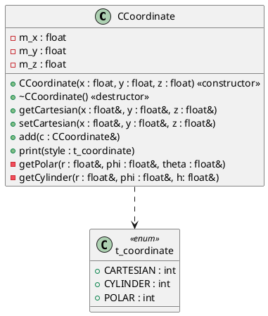
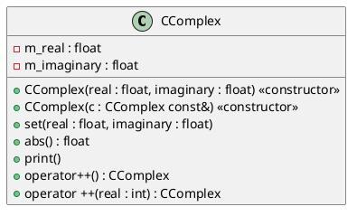
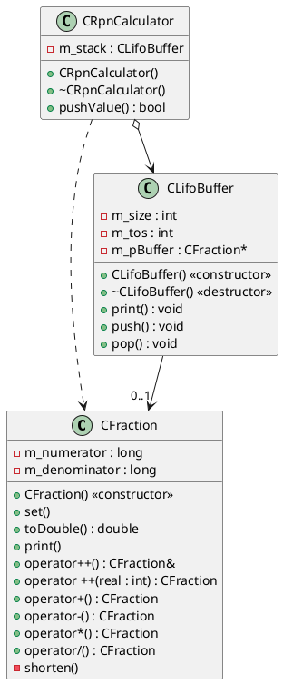
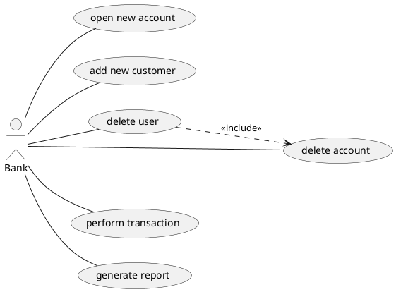
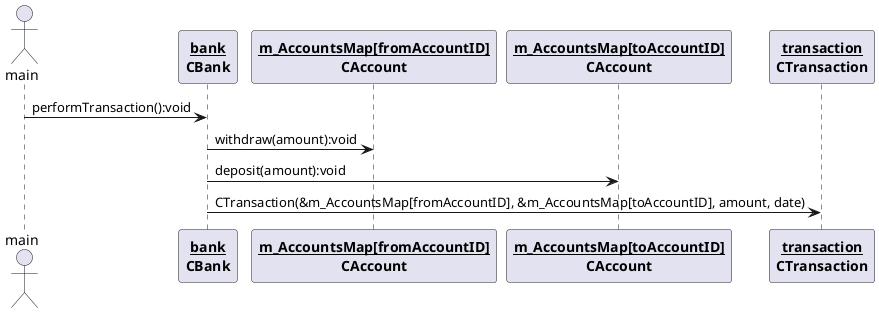
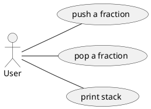
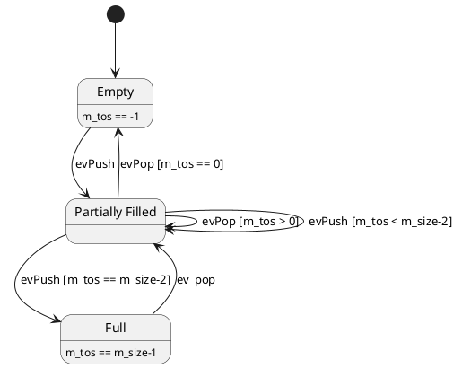
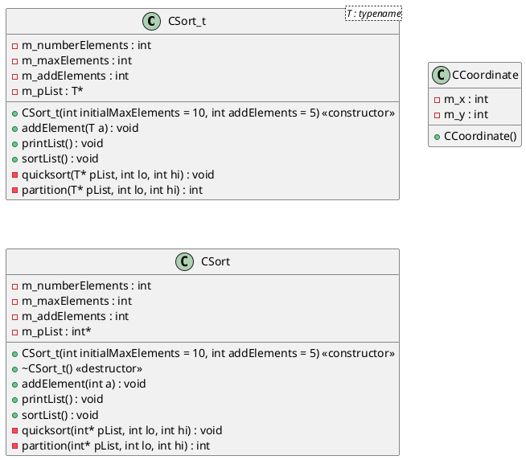

# Lab Exercises

## Lab 1

<!---->

## Lab 2


<!--/myCode/classdiagram.png)-->

## Lab 3


<!--/myCode/classdiagram.png)-->

# Optional Exercises

## 2 Simple Exercises

This section contains simple exercises which are intended to get you familiar with basic C++
syntax. You get a detailed description of what you have to do and the project scope is limited to a
single class only.


### 2.1 CCoordinate

Develop a class which stores three coordinate values and represents them in either Cartesian,
cylinder or polar format.

* input validation
* private member variables
* public getter and setter methods
* operator overloading
* methods which take a CCoordinate& (reference!) as argument, can't be called with CCoordinate(1,2,3):
`cannot bind non-const lvalue reference of type ‘CCoordinate&’ to an rvalue of type ‘CCoordinate’`



### 2.2 Set of Measurement Values

Develop a class which stores a set of measurement values. Do not forget to comment your code.

* static array as member variable: `double m_value[10]`
* initializing static array in constructor:
```c++
for(int i = 0; i < 10; i++) {
	m_value[i] = NOVALUE;
}
```
* input validation
* random
* `typedef enum {A, V, S, W, NONE} t_unit;`


<!---->

## 3 Medium Exercises

These exercises are slightly more challenging. You will have to deal with more than one class and
use more advanced language feature like operator overloading, dynamic memory and similar.


### 3.1 CComplex: Operator Overloading

Develop a class which stores complex numbers of the format c = a+bi and supports the unary
operations +,-,*,/ as well as the unary operations c++ and ++c.

* operator overloading
	* also operator<<(): `friend std::ostream& operator <<(std::ostream& out, CComplex& c);`
	```c++
	std::ostream& operator <<(std::ostream& out, CComplex& c) {
		out << c.m_real;

		if(c.m_imaginary > 0) {
			out << " + i" << c.m_imaginary;
		} else if(c.m_imaginary < 0) {
			out << " - i" << abs(c.m_imaginary);
		} else if(c.m_imaginary == 0) {
			// print nothing else
		}
		return out;
	}
	```
* done as member methods instead of friend methods
* copy constructor: `CComplex(CComplex const& c);`
* operator+() etc.
	```cpp
	CComplex CComplex::operator+(const CComplex& c) {
		float real, imaginary;
		real = m_real + c.m_real;
		imaginary = m_imaginary + c.m_imaginary;
		return CComplex(real, imaginary);
	}
	```
	* return a new object
* pre- and postincrement operators
	* add the value 1 to both the real and the imaginary part of the complex number
	* require different methods:
		* `CComplex operator++();`
			```c++
			CComplex CComplex::operator ++() {
				m_real++;
				m_imaginary++;
				return *this;
			}
			```
			* increment members, then return object

		* `CComplex operator++(int real);`
			```c++
			CComplex CComplex::operator ++(int real) {
				CComplex oldValue(*this);
				m_real++;
				m_imaginary++;
				return oldValue;
			}
			```
			* store the old object, increment members, return old object



### 3.2 Calculator for Fractions

Develop a class which stores fractions using the format f=n/d and supports the binary operations
+, -, *, / as well as the unary operations c++ and ++c.


* operator overloading
* input validation


#### 3.2.1 Extension - An RPN Calculator

Now you will implement a calculator for evaluating expressions of fractions noted in _reverse
polish notation_.

* dynamically allocated statc array
* but array is not being resized anywhere
* array boundary checks
* delete[]ing dynamic memory
* operations look like this:
	```c++
	void CRpnCalculator::multiply() {
		CFraction operand1, operand2;
		stack.pop(operand1);
		stack.pop(operand2);
		stack.push(operand1 * operand2);
	}
	```



<!---->

### 3.3 CBank: Class design

Your task is to develop a bank simulation program which implements the following Use Cases.

* std::map
* to add a key-value pair to a std::map, a std::pair has to be created first:
	```c++
	m_CustomersMap.insert(std::pair<std::string,CCustomer>(name, customer));
	```

```
std::map::at
 
T& at( const Key& key );
const T& at( const Key& key ) const;		

Returns a reference to the mapped value of the element with key equivalent to key. If no such element exists, an exception of type std::out_of_range is thrown.

```

* Example of catching exceptions thrown by std::map::at():
	```c++
	try {
		m_AccountsMap.at(fromAccountID).withdraw(amount);
	} catch (std::exception& e) {
		std::cerr << "Exception thrown by " << e.what() << std::endl;
		return;
	}
	```

```
std::map::operator[]

	apped_type& operator[] (const key_type& k);
	mapped_type& operator[] (key_type&& k);

Access element
If k matches the key of an element in the container, the function returns a reference to its mapped value.

If k does not match the key of any element in the container, the function inserts a new element with that key and returns a reference to its mapped value. Notice that this always increases the container size by one, even if no mapped value is assigned to the element (the element is constructed using its default constructor).

A similar member function, map::at, has the same behavior when an element with the key exists, but throws an exception when it does not.
```

```
std::map::find

	iterator find (const key_type& k);
	const_iterator find (const key_type& k) const;

Get iterator to element
Searches the container for an element with a key equivalent to k and returns an iterator to it if found, otherwise it returns an iterator to map::end.
```
* std::map iterator:
	```c++
	std::map<std::string,CCustomer>::iterator it;
	for(it = m_CustomersMap.begin(); it != m_CustomersMap.end(); it++) {
		std::cout << "...for customer: " << it->second.getName() << std::endl;
	}	
	```
	* it->first
	* it->second.getName()
* base() converts a reverse iterator into the corresponding forward iterator. It's not necessary if you already have a forward iterator, but it doesn't hurt
* std::set
	```
	std::set

	Set
	Sets are containers that store unique elements following a specific order.

	In a set, the value of an element also identifies it (the value is itself the key, of type T), and each value must be unique. The value of the elements in a set cannot be modified once in the container (the elements are always const), but they can be inserted or removed from the container.
	```
* std::vector<>::iterator it:
	*  it->getDate()
* private static member variables:
	* .h: `static int m_ID;`
	* .cpp: `int CBank::m_ID = 123456;` (outside of any method)
* `std::sort(myvector.begin(), myvector.end());` requires that `operator<()` is implemented for class T:
	* declaration:
	```c++
	friend bool operator<(CTransaction& l, CTransaction& r);
	```
	* implementation:
	```c++
	bool operator<(CTransaction& l, CTransaction& r) {
		return l.getFromAccount().getID() < r.getFromAccount().getID();
	}
	```
* iterating over a returned container requires storing he container first!
	```c++
	// iterate over all the customer's accounts
	std::vector<int> associatedAccountIDs = it->second.getAssociatedAccountIDs();
	for(std::vector<int>::iterator itAssociatedAccountID = associatedAccountIDs.begin(); itAssociatedAccountID != associatedAccountIDs.end(); itAssociatedAccountID++) {
		
	```
* NOT like this: (we can't access the container since we don't have it stored anywhere outside the class)
	```c++
	for(std::vector<int>::iterator itAssociatedAccountID = it->second.getAssociatedAccountIDs().begin(); itAssociatedAccountID != it->second.getAssociatedAccountIDs().end(); itAssociatedAccountID++) {
	```
* printing std::map content:
	* e.g. when using a std::map<std::string, CCustomer>:
		* print `it->second.getName()` instead of `it->first`, since one might change the key later on




<!---->



### 3.4 CPhoneList: Libraries

Your task is to implement a set of classes which reads a set of names and phone numbers from a
file and transforms them into a “relational” format. In addition, the data representation is cleaned up
and the data is checked for consistency, i.e. detection of double occupied numbers and empty
records

* Used libraries:
	* fstream: file operations
	```c++
	std::ofstream file;
	file.open(filename);
	if(file.is_open()) {
		file << "bla" << std::endl;
		file.close();
	}
	```

	```c++
	std::ifstream file;
	std::string name;
	file.open(filename);
	if(file.is_open()) {
		while(!file.eof()){
			name = "";
			std::getline(file,name,';');
			storeName(name);
		}
		file.close();
	}
	```
* we first create CSimpleList instance and read a file
* then we create a CPhoneList and call readAndTransformSimpleList() with the CSimpleList object as argument
* finally, we save the CPhoneList to a file


<!---->

## 3.5 Tests for LIFO Buffer and RPN Calculator

In this exercise you will provide test cases for the LIFO buffer and RPN calculator developed in
exercise 5, using the CppUnit library and the Coverage Tool presented in the lecture.

### Deriving test cases from use cases
Use case diagram for CLifoBuffer:


Derived Use Case Template:

Name | UC-1: push a fraction 
--- | ---
Goal in context | ...
Scope & Level | ...
Preconditions | ...
Success End Condition | ...
Failure End Condition | ...
Trigger | ...
Step-by-step description | ...
Open issues | ...
Other information | ...

> UCs push a fraction & pop a fraction

> push 3 fractions & print stack

### Deriving test cases from boundary values

Boundaries: Buffer sizes 2 and 10

> Test cases: Buffer sizes 1,2,3 and 9,10,11

### Deriving test cases from state diagram
* m_tos is the index of the _top of the stack_, and is used access the element via `m_stack[m_tos]`
	* when there's no elements in the stack: m_tos == -1
	* when there's 1 element in the stack: m_tos == 0
	* when the stack is full (n elements): m_tos == n-1

> create 1 test case for each transition

> create 1 test case for each transition (state & event combination not listed -> including guards)

### Setting up CppUnit in Eclipse

* C/C++ General > Paths and Symbols: create new build configuration UnitTest derived from Debug
* create new top-level folder _test_
* C/C++ General > Paths and Symbols > Source Location: exclude main.cpp from _myCode_ or _src_ (don't use the very top-level path, but the src or myCode folders!) & add _test_ folder
* C/C++ Build > Settings > GCC C** Linker: add cppunit as library and /usr/lib64 as library search path
* add a launch configuration & select the binary

* IMPORTANT: all member variables in test cases which are object must be pointers, otherwise these errors may occurr:
	* `error: expected identifier before numeric constant`
	* `error: expected ‘,’ or ‘...’ before numeric constant`

```c++
#include <cppunit/TestRunner.h>
#include <cppunit/TestResult.h>
// https://stackoverflow.com/questions/13210248/cppunit-creating-a-simple-test
#include <cppunit/ui/text/TestRunner.h>
#include <cppunit/TestResultCollector.h>
#include <cppunit/TextOutputter.h>

#include "CUseCaseTests.h"

/**
 * To view the generated *.gcda coverage data file,
 * the gcov Eclipse plugin needs to be installed
 */
int main (int argc, char* argv[]) {
	// Eclipse in-built indexer is worse than useless:
	// https://stackoverflow.com/a/10081040/2278742

	// https://schneide.wordpress.com/2009/04/14/structuring-cppunit-tests/

	CppUnit::TestResult controller;
	CppUnit::TestResultCollector result;
	controller.addListener ( &result );
	CppUnit::TextUi::TestRunner runner;

	runner.addTest( CUseCaseTests::suite() );

	runner.setOutputter(new CppUnit::TextOutputter(&runner.result(), std::cout));

	return runner.run ("", false, true, false) ? 0 : 1;
}
```

### Settings for gcov coverage reports in Eclipse
* install gcov Eclipse plugin
* C/C++ Build > Settings > GCC C++ Compiler: [x] Generate gcov information (-ftest-coverage -fprofile-arcs)
* C/C++ Build > Settings > GCC C++ Linker > Miscellaneous: Linker flags: -fprofile-arcs -ftest-coverage

* then run UnitTest code
* double-click on UnitTest/test/main.gcda
* Show coverage for the whole selected binary

## 4 Challenging Exercises

In this exercise you will provide test cases for the LIFO buffer and RPN calculator developed in
exercise 5, using the CppUnit library and the Coverage Tool presented in the lecture.


### 4.1 XML Parser

In this exercise you will implement a simple XML Parser, which translates textual XML format into
an internal representation.


<!---->

### 4.2 CSort: Template Class

Your task is to implement a class, which is able to store any number of any object and to sort the
list of these objects.

* CSort & CSort_t each use a dynamically allocated array
* if addElement() is called and the array is full:
	* a new array is allocated, which is `m_addElements` elements bigger
	* the values are copied from the old array to the new array
	* the old array is delete[]d
	* the pointer to the new array replaces the pointer to the old one

	```c++
	void CSort::addElement(int a) {
		// if m_pList is full
		if(m_numberElements >= m_maxElements) {
			// allocate a new, bigger array
			int* m_pListCopy = new int[m_maxElements+m_addElements];
			// copy the values from the old into the new array
			for(int i = 0; i < m_numberElements; i++) {
				m_pListCopy[i] = m_pList[i];
			}
			// free the memory
			delete[] m_pList;
			// allocate new memory
			m_pList = m_pListCopy;
			m_maxElements += m_addElements;
		}
		m_pList[m_numberElements] = a;
		m_numberElements++;
	}
	```

	* the template implementation is basically the same:
	```c++
	template<typename T> void CSort_t<T>::addElement(T a) {
		// if m_pList is full
		if(m_numberElements >= m_maxElements) {
			// allocate a new, bigger array
			T* m_pListCopy = new T[m_maxElements+m_addElements];
			// copy the values from the old into the new array
			for(int i = 0; i < m_numberElements; i++) {
				m_pListCopy[i] = m_pList[i];
			}
			// free the memory
			delete[] m_pList;
			// allocate new memory
			m_pList = m_pListCopy;
			m_maxElements += m_addElements;
		}
		m_pList[m_numberElements] = a;
		m_numberElements++;
	}
	```

	* Quicksort has been implemented according to the [Hoare partition scheme](https://en.wikipedia.org/wiki/Quicksort#Hoare_partition_scheme):

	```c++
	template<typename T> void CSort_t<T>::quicksort(T* pList, int lo, int hi) {
		if(lo < hi) {
			int p = partition(pList, lo, hi);
			quicksort(pList, lo, p);
			quicksort(pList, p + 1, hi);
		}
	}

	template<typename T> int CSort_t<T>::partition(T* pList, int lo, int hi) {
		T pivot = pList[lo];
		int i = lo - 1;
		int j = hi + 1;
		while(true) {
			do {
				i++;
			} while(pList[i] < pivot);

			do {
				j--;
			} while(pList[j] > pivot);

			if(i >= j) {
				return j;
			}

			T tmp;
			tmp = pList[i];
			pList[i] = pList[j];
			pList[j] = tmp;
		}
	}
	```

	* templated methods of template classes must be implemented in the .h header file, since
		* a class template is not a class, it's a recipe for creating a new class for each T we encounter. A template cannot be compiled into code, only the result of instantiating the template can be compiled.
		* .cpp files are all compiled separately! The compiler doesn't care for any other .cpp files other than the one it's compiling right now. Thus the compiler uses the .h file of a class template (e.g. CSort_t\<T\>) to create the concrete classes required by the .cpp file. E.g. if the .cpp file uses CSort_t<int>, then a class CSort_tINT is created in the background. For thi new class, the compiler has to have access to the implementation. Therefor, the implementation neds to be in the .h file.
	* for std::list::sort() to work, the stored type has to provide an operator<() method



<!---->

### 4.3 Combining Techniques

# Live Code

## Live Code 1

C-equivalent of classes: structs, but they can't have methods


<!---->

## Live Code 2a


<!---->

## Live Code 2b

* getIndex(row, column) returns the array index of a matrix element
* the enum matrixInit_t  is used to specify how the matrix should be initialized


<!---->


<!---->

## Live Code 3a
* added a copy constructor
* added a static variable to count the number of instances

```plantuml
@startuml
class CMatrix {
 	- m_pData : matrixdata_t* 
 	- m_noColumns : unsigned short
	- {static} m_count : int
 	- m_noRows : unsigned short

 	+ CMatrix()
	+ CMatrix()
 	+ ~CMatrix()
 	+ print() : void
	+ set() : bool
 	- getIndex() : unsigned int
}
class matrixInit_t << enum >> {
 	+ int ZERO
 	+ int ONE
 	+ int UNIT
 	+ int INDEX
}

CMatrix ..> matrixdata_t

@enduml
```

<!---->

```plantuml
@startuml
left to right direction
actor Programmer

Programmer -- (create matrix)
Programmer -- (print matrix content)
Programmer -- (set values inside matrix)
Programmer -- (multiply matrix)
Programmer -- (delete matrix)

@enduml
```

<!---->

## Live Code 3b

* Lidar::m_pScan: aggregation by value
* Lidar::m_Cuart: association

```plantuml
@startuml
class CUart {

}
interface Lidar {
	- m_pScan : CMeasurementValue*
	- m_CUart : CUart
}
class CMeasurementValue {
	- m_distance : float
	- m_angle : float
}

CUart <-left- Lidar
Lidar "1"*-right->"1" CMeasurementValue
@enduml
```

<!---->

```plantuml
@startuml
node Car
node HMI
node Laserscanner
node Controller
node Motioncontroller
[Lidar]
[Communication]
[Controller] as Controller_SW
[Actuator]
() Lidar as Lidar_IF

Car o-- HMI
Car o-- Laserscanner
Car o-- Controller
Car o-- Motioncontroller

Laserscanner o-- Lidar
Controller o-- Communication
Controller o-- Controller_SW
Controller o-- Actuator
Communication -- Controller_SW
Controller_SW -- Actuator

Lidar --> Lidar_IF

note left of Car: Node represents an entity of hardware + optional software

note left of Lidar: A component represents a software functionality, whic may come\nout of any number of classes

note left of Lidar_IF: An interface class is a class which serves as an external interface\nto a component. Also reffered to as public class

@enduml
```

<!---->

## Live Code 3c

* typedef matrixdata_t CCoordinate
* each element is a CCoordinate: e.g. m_pData[i] = CCoordinate(0,0);

```plantuml
@startuml
class CCoordinate {
	- m_x : int
	- m_y : int

	+ CCoordinate(x:int, y:int) <<constructor>>
	+ print() : void
	+ set(x:int, y:int) : bool
}
class matrixInit_t << enum >> {
 	+ int ZERO
 	+ int ONE
 	+ int UNIT
 	+ int INDEX
}
class CMatrix {
 	- m_pData : matrixdata_t* 
 	- m_noColumns : unsigned short
 	- m_noRows : unsigned short
	- {static} m_count : int

 	+ CMatrix() <<constructor>>
	+ CMatrix() <<copy constructor>>
 	+ ~CMatrix()
 	+ print() : void
 	- getIndex() : unsigned int
}

CMatrix "1"*-->"1..*" CCoordinate
CMatrix ..> matrixInit_t

@enduml
```

<!---->

## Live Code 4

```plantuml
@startuml
left to right direction
actor Programmer
rectangle GraphicalSystem {
 	Programmer -- (Create graphical objects)
 	Programmer -- (Print the objects on a single screen)
 	(Print the objects on a single screen) .up.> (Create graphical objects) : <<include>>
 	(Print the objects on a single screen) <.down. (Print the objects on multiple screens): <<extend>>
 	Programmer -- (Move objects on the screen)

 	note right of (Create graphical objects)
 	The include relation might be a bit overengineered
 	end note
}

(Print the objects on multiple screens) <.left. (Display objects on real GUI) : <<extend>>
@enduml
```

* CGraphicObject::print() calls CCoordinate::print() for all its coordinates

```plantuml
@startuml
class CGraphicalSystem {
 	- m_database : CDatabase
 	- m_screen : CScreen

 	+ CGraphicalSystem() <<constructor>>
 	+ print() : void
}
class CDatabase {
 	- m_size : unsigned int
 	- m_nextFreeTriangle : unsigned int
	- m_circle : CCircle*
	- m_triangle : CTriangle*
	- m_rectangle : CRectangle*

 	+ CDatabase() <<constructor>>
 	+ print() : void
 	+ addElement() : bool
 	+ getAddressOfTriangle() : CTriangle* 
}
class CScreen {
 	- m_size : unsigned int
 	- m_nextFreeTriangle : unsigned int
 	- m_pTriangle : CTriangle** 
 	- m_pDatabase : CDatabase*

 	+ CScreen() <<constructor>>
 	+ connect() : void
 	+ addElement() : bool
 	+ print() : void
}
class CGraphicObject {
 	- m_name : std::string
 	- m_noCoordinates : unsigned int
 	# m_pCoordinate : CCoordinate* 

 	+ CGraphicObject() <<constructor>>
 	+ set() : bool
 	+ print() : void
 	+ move() : bool
 	+ operator=() : CGraphicObject& 
 	+ getName() : std::string
}
class CCircle {
 	- m_radius : unsigned int
 	+ CCircle() <<constructor>>
 	+ print() : void
}
class CRectangle {
 	+ CRectangle() <<constructor>>
}
class CTriangle {
 	+ CTriangle() <<constructor>>
}
class CCoordinate {
 	- m_x : int
 	- m_y : int

 	+ CCoordinate() <<constructor>>
 	+ print() : void
 	+ set() : bool
}

CGraphicalSystem *--> CDatabase
CGraphicalSystem *--> CScreen
CScreen -->"0..1" CDatabase

CDatabase ..> CTriangle
CDatabase ..> CRectangle
CDatabase ..> CCircle
CDatabase "1"*-->"0..*" CGraphicObject

CScreen o-->"0..*" CGraphicObject

CTriangle --|> CGraphicObject
CRectangle --|> CGraphicObject
CCircle --|> CGraphicObject

CGraphicObject "1"*-->"0..1" CCoordinate
@enduml
```

<!---->

## Live Code 5

* the code is the same as in 'Live Code 4', except for
	* now we can store and display more than just CTriangles
	* we delete the dynamically allocated memory in m_pObject
	* we check full null pointers prior to dereferencing
	* CDatabase::addElement() creates an instance of the desired type
	* ~CGraphicObject() deletes the created Coordinate
	* Polymorphism: make CGraphicObject's methods virtual
	* constructor of derived object first call the superclass' constructor via the intializer list
	* added error messages to CScreen::addElement() in case the object wasn't found in the database or the static array is full
* similar to Lab 1: CGraphicObjects are stored in (i.e. memory is provided by) CDatabase
* CScreen stores a pointer to the CDatabase instance
* CScreen::addElement() calls CDatabase::getAddressOfObject() and stores the CGraphicObject's address in m_pObject

```plantuml
@startuml
class CGraphicalSystem {
 	- m_database : CDatabase
 	- m_screen : CScreen

 	+ CGraphicalSystem() <<constructor>>
 	+ print() : void
}
class CDatabase {
 	- unsigned m_size : int
 	- unsigned m_nextFreeObject : int
 	- m_pObject : CGraphicObject** 

 	+ CDatabase() <<constructor>>
 	+ ~CDatabase() <<destructor>>
 	+ print() : void
 	+ addElement() : bool
 	+ CGraphicObject* getAddressOfObject()
}
class CScreen {
 	- unsigned m_size : int
 	- unsigned m_nextFreeObject : int
 	- m_pObject : CGraphicObject** 
 	- m_pDatabase : CDatabase

 	+ CScreen() <<constructor>>
 	+ ~CScreen() <<destructor>>
 	+ connect() : void
 	+ addElement() : bool
 	+ print() : void
}
class CGraphicObject {
 	- m_name : std::string
 	- unsigned m_noCoordinates : int
 	# m_pCoordinate : CCoordinate* 

 	+ CGraphicObject() <<constructor>>
 	+ ~CGraphicObject() <<destructor>>
 	+ set() : bool
 	+ void print
 	+ bool move
 	+ CGraphicObject& operator=
 	+ getName() : std::string
}
class CCircle {
 	- m_radius : unsigned int

 	+ CCircle() <<constructor>>
 	+ print() : void
}
class CRectangle {
 	+ CRectangle() <<constructor>>
}
class CTriangle {
 	+ CTriangle() <<constructor>>
}
class CCoordinate {
 	- m_x : int
 	- m_y : int

 	+ CCoordinate() <<constructor>>
 	+ print() : void
 	+ set() : bool
}

CGraphicalSystem *--> CDatabase
CGraphicalSystem *--> CScreen
CScreen -->"0..1" CDatabase

CDatabase ..> CTriangle
CDatabase ..> CRectangle
CDatabase ..> CCircle
CDatabase "1"*-->"0..*" CGraphicObject

CScreen o-->"0..*" CGraphicObject

CTriangle --|> CGraphicObject
CRectangle --|> CGraphicObject
CCircle --|> CGraphicObject

CGraphicObject "1"*-->"0..1" CCoordinate
@enduml
```

<!---->

```plantuml
@startuml
left to right direction
actor Programmer
rectangle GraphicalSystem {
 	Programmer -- (Create graphical objects)
 	Programmer -- (Print the objects on a single screen)
 	(Print the objects on a single screen) .up.> (Create graphical objects) : <<include>>
 	(Print the objects on a single screen) <.down. (Print the objects on multiple screens): <<extend>>
 	Programmer -- (Move objects on the screen)

 	note right of (Create graphical objects)
 	The include relation might be a bit overengineered
 	end note
}

(Print the objects on multiple screens) <.left. (Display objects on real GUI) : <<extend>>
@enduml
```

<!---->

```plantuml
@startuml
class CCircle {
 	-m_radius : unsigned int

 	+ CCircle() <<constructor>>
 	+ print() : void
}
class CRectangle {
 	+ CRectangle() <<constructor>>
}
class CTriangle {
 	+ CTriangle() <<constructor>>
}
class CGraphicObject {
 	- m_name : std::string
 	- unsigned m_noCoordinates : int
 	# m_pCoordinate : CCoordinate* 

 	+ CGraphicObject() <<constructor>>
 	+ ~CGraphicObject()
 	+ set() : bool
 	+ void print
 	+ bool move
 	+ CGraphicObject& operator=
 	+ getName() : std::string
}
class CCoordinate {
 	- m_x : int
 	- m_y : int

 	+ CCoordinate() <<constructor>>
 	+ print() : void
 	+ set() : bool 	
}

CCircle --|> CGraphicObject
CRectangle --|> CGraphicObject
CTriangle --|> CGraphicObject

CCircle ..> CCoordinate
CTriangle ..> CCoordinate

CGraphicObject "1"*-->"1..*" CCoordinate

note left of CCircle: Inheritance\nA circle "is" a graphical object

@enduml
```

<!---->

## Live Code 6a

```plantuml
@startuml
left to right direction
Captain -- (Navigate the boat)
Captain -- (Enter and leave the boat)
Sailor -- (Enter and leave the boat)
Sailor -- (Raise sails)
Boat -- (Sail the vast sea)

(Create Boat, Captain, Sailor objects) -- :Simulation user:
(Choose boat and have crew enter the boat) -- :Simulation user:
(Have captain navigate) -- :Simulation user:
(Have crew set the sails) -- :Simulation user:

@enduml
```

* Polymorphism: CSailingSimulator could store an array of pointers of type CBoat pointing to instances of CLongboat, CDinghy and CCruiser, but for that, these methods would need to be virtual in CBoat

```plantuml
@startuml
class CBoat {
	- m_speed : int
	- m_course : int
	- m_maxSpeed : int

	+ command() : void
	+ sail() : void
	+ leaveBoat() : void
	+ enterBoat() : void
}
class CLongboat
class CDinghy
class CCruiser
class CPerson {
	- m_age : int
	- m_name : std::string
}
class CSailingSimulator
class CSailor {
	+ raiseSails() : void
	+ climbMast() : void
}
class CCaptain {
	+ navigate() : void
}

CBoat o-->"1..*" CPerson
CLongboat --|> CBoat
CDinghy --|> CBoat
CCruiser --|> CBoat
CSailor --|> CPerson
CCaptain --|> CPerson
CSailingSimulator *-- CLongboat
CSailingSimulator *-- CDinghy
CSailingSimulator *-- CCruiser
CSailingSimulator *-- CSailor
CSailingSimulator *--"1..*" CCaptain
@enduml
```
<!---->

## Live Code 6b

```plantuml
@startuml
(*) --> "Select Snack" as select
if "" then
-->[snack tray is empty] select
else
-->[snack tray is not empty] "Show price on display"
endif
"Show price on display" --> "Enter money or press cancel" as enter
note left: Cancel can be pressed anytime
if "" then
-right->[entered money not sufficient] enter
else
-->[Cancel pressed] "Return money"
--> (*)
else
--> "Return change"
--> "Deposit snack"
--> (*)
endif
@enduml
```

<!--
new syntax doesn't support aliases yet, which are necessary to reference existing states

```plantuml
@startuml
start
:Select Snack;
:Show price on display;
:Enter money or press cancel;
floating note left: Cancel can be pressed anytime
:Return change;
:Deposit snack;
stop
@enduml
```-->

<!---->

```plantuml
@startuml
class CPaymentSlot {
 	+ returnChange() : void
 	+ returnMoney() : void
 	+ enterMoney() : void
}
class CSnackMachine {
 	- m_tray : CTray
 	- m_display : CDisplay
 	- m_keyboard : CKeyboard
 	- m_snackArray : CSnackArray
 	- m_paymentSlot : CPaymentSlot

 	- checkPayment() : void
 	+ run() : void
}
class CSnackArray {
 	- m_snack : CSnack* 
 	m_number : int

 	+ deliverSnack() : void
 	+ getNumberOfSnacks() : void
 	+ getPrice() : float
}
class CSnack {
 	- m_price : float
 	- m_name : string

 	+ getPrice() : void
}
class CTray {
 	+ getOpenStatus() : void
}
class CDisplay {
 	+ displayString() : void
}
class CKeyboard {
 	+ getCancel() : void
 	+ getNumber() : void
}


CSnackMachine *--> CPaymentSlot
CSnackMachine *--> CTray
CSnackMachine *--> CDisplay
CSnackMachine *--> CKeyboard
CSnackMachine *--> CSnackArray

CSnackArray -->"0..1" CSnack
@enduml
```

<!---->

```plantuml
@startuml

actor main
main -> "<b><u>m_snackmachine\n<b>CSnackMachine</b>" : 1: run():void

"<b><u>m_snackmachine\n<b>CSnackMachine</b>" -> "<b><u>m_display</u></b>\n<b>CDisplay</b>" : 1.1: displayString():void
"<b><u>m_snackmachine\n<b>CSnackMachine</b>" <-- "<b><u>m_display</u></b>\n<b>CDisplay</b>"

"<b><u>m_snackmachine\n<b>CSnackMachine</b>" -> "<b><u>m_keyboard</u></b>\n<b>CKeyboard</b>" : 1.2 getNumber():void

"<b><u>m_snackmachine\n<b>CSnackMachine</b>" -> "<b><u>m_snacktray</u></b>\n<b>CSnackArray</b>" : 1.3:getNumberOfSnacks():void

"<b><u>m_snackmachine\n<b>CSnackMachine</b>" -> "<b><u>m_snacktray</u></b>\n<b>CSnackArray</b>" : 1.4:getPrice():float

"<b><u>m_snacktray</u></b>\n<b>CSnackArray</b>" -> "<b><u>m_snack</u></b>\n<b>CSnack</b>" : 1.4.1:getPrice():void

"<b><u>m_snackmachine\n<b>CSnackMachine</b>" -> "<b><u>m_payslot</u></b>\n<b>CPaymentSlot</b>" : 1.5:enterMoney():void

"<b><u>m_snackmachine\n<b>CSnackMachine</b>" -> "<b><u>m_snacktray</u></b>\n<b>CSnackArray</b>" : 1.6:deliverSnack():void

"<b><u>m_snackmachine\n<b>CSnackMachine</b>" -> "<b><u>m_payslot</u></b>\n<b>CPaymentSlot</b>" : 1.7:returnChange():void

"<b><u>m_snackmachine\n<b>CSnackMachine</b>" -> "<b><u>m_tray</u></b>\n<b>CTray</b>" : 1.8:getOpenStatus():void

@enduml

@enduml
```

<!---->

```plantuml
@startuml

[*] --> IS_IDLE

IS_IDLE -left-> IS_IDLE : ev_PressButton[!trayIsNotEmpty()]\n/showMessage()

IS_IDLE -down-> IS_IDLE : ev_EnterMoney/returnMoney()

IS_IDLE -down-> IS_WAITINGPAYMENT : ev_PressButton[trayIsNotEmpty()]

IS_WAITINGPAYMENT : entry()/showRemeiningPrice()

IS_WAITINGPAYMENT --> IS_IDLE : ev_Cancel/returnMoney()

IS_WAITINGPAYMENT -down-> IS_PROVIDINGSNACK

IS_PROVIDINGSNACK : entry()/provideSnack()

IS_PROVIDINGSNACK -down-> IS_PROVIDINGSNACK : evEnterMoney/returnMoney()

IS_PROVIDINGSNACK -right-> IS_IDLE : ev_OpenTray

IS_PROVIDINGSNACK -right-> IS_IDLE : ev_Timeout

note "Events:\nev_EnterMoney\nev_PressButton\nev_Cancel\nev_OpenTray(?)" as N1

@enduml
```

<!---->

```plantuml
@startuml
left to right direction

Customer -- (Charge student card)

rectangle Snackmachine {
 	Customer -- (Choose the snack)
 	Customer -- (Buy a snack)
 	(Get snack status)
 	Customer -- (Enter money)

 	

 	(Buy a snack) ..> (Choose the snack) : <<include>>
 	(Buy a snack) ..> (Enter money) : <<include>>

 	(Pay by student card) ..> (Enter money) : <<extend>>
}


ShopOwner -- (Get snack status)
@enduml
```

<!---->

## Live Code 7

* what's new:
	* operator overloading
	* std::vector container
	* outpush file streams
* operator<<() is alway declared as a global friend method, which is not part of CComplexSet

```plantuml
@startuml
class CComplex {
	- m_r : float
	- m_i : float

	+ CComplex()
	+ CComplex()
	+ operator+() : CComplex
	+ operator=() : CComplex&
	+ operator+=() : CComplex&

	complex_t
}
class CComplexSet {
	- m_data : std::vector<CComplex>

	+ CComplexSet()
	+ addElement() : void
	+ print() : void
	+ saveToFile() : void
}

CComplexSet o-->"1..*" CComplex

@enduml
```

<!---->

## Live Code 8a

* we're not creating new classes this time
* we demo std::vector's methods
* we get to know std::list
* we get to know std::map
* we use exceptions thrown by std::vector

## Live Code 8b

* class templates
* type of class member can be specified at runtime
* nested templates!
* default values for template type

```c++
template <template <class TCONTENT> class TDATA, class TCONTENT = int>
class CMatrix
{
private:
	TDATA<TCONTENT>* m_buffer;
public:
	CMatrix(unsigned int rows, unsigned int columns);
};
```

```plantuml
@startuml
class Coordinate<T:class> {
	- m_x : T
	- m_y : T

	+ Coordinate() <<constructor>>
	+ operator>() : bool
	+ print() : void
}
class CMatrix<TDATA<TCONTENT:class>:class,TCONTENT = int:class> {
	- m_buffer : TDATA<TCONTENT>

	+ CMatrix() <<constructor>>
}
@enduml
```

<!---->

## Live Code 8c

* no self-created classes
* std::list
* iterator
* reverse_iterator

## Live Code 9

* similar to Lab 3
* CCSV and CJSON are both derived from CFormat

```plantuml
@startuml
class CStorage {
 	+ getNextEntryAsString() : void 
}
class CCSV
class CJSON
class CFileIO {
 	+ read() : void
 	+ write() : void
}
class CFormat {
 	+ translateFromFormat() : void
 	+ translateToFormat() : void
}
class CExport {
 	- m_pFormat : CFormat* 
}
class CPhoneEntry {
 	- unsigned m_number : int
 	- m_name : string

 	+ getStringRepresentation() : void
}
class CWaypoint {
 	- m_latitude : double
 	- m_longitude : double
 	- m_name : string

 	+ void getStringRepresentation
}

CExport "1"*--"1" CFormat
CExport *-- CFileIO
CAddressDatabase "1"*--"1" CStorage
CAddressDatabase *-- CExport
CStorage "0..1"-- CExport
CFormat <|-- CCSV
CFormat <|-- CJSON

note top of CExport: 2 Options: We can have the\nAddress-DB class do the work,\nwhich means that this class\nwill become pretty complex\nor we can delegate sub-jobs\nto other classes, e.g. the\n Import/Export story
note right of CFormat: Format and basic file IO\ncan be separated into 2\nclasses

note bottom of CPhoneEntry: Example data class

note bottom of CWaypoint: Example data class

note left of CStorage: In a first step we can provide a\nreference to the container storing\nthe data. Later on, we can provide a\nmore intuitive interface.
@enduml
```
<!---->

## Live Code 10

* unit testing with cppcheck
* create separate build and launch configurations for unit tests
* unit test main.cpp:
	* TextUi::TestRunner runner;
	* runner.addTest(CLoadTests::suite());
	* runner.run();
* test suite:
	* create 1 test class for each method that should be tested
	* create a number of tests in each class
	* add all tests to testsuite

```c++
class CLoadTests: public CppUnit::TestFixture {
public:

	void testLoadExisting() {
		CAddressDB* adb = new CAddressDB("AddressDB.txt");
		CPPUNIT_ASSERT(adb->loadFromFile());
		delete adb;
	}

	void testLoadMissing() {
		CAddressDB* adb = new CAddressDB("NonExistantDB.txt");
		CPPUNIT_ASSERT(!adb->loadFromFile());
		delete adb;
	}

	static CppUnit::TestSuite* suite() {
		CppUnit::TestSuite* suite = new CppUnit::TestSuite("Load Tests");

		suite->addTest(new CppUnit::TestCaller<CLoadTests>
				 ("Load Existing", &CLoadTests::testLoadExisting));

		suite->addTest(new CppUnit::TestCaller<CLoadTests>
				 ("Load Missing", &CLoadTests::testLoadMissing));

		return suite;
	}
};
```

```plantuml
@startuml
class Test::BasicTest {
 	- CAddressDB* -m_db

 	-int menu()
 	- appendFromKeyboard() : void
 	+ run() : void

}
class APT::CAddressDB {
 	-std::m_filename : string
 	- vector<APT::Record>m_records : 
 	- std::map<int,APT::CRecord>m_recordsByNumber : 

 	+ CAddressDB(filename: std::string)
 	+ ~CAddressDB()
 	+const CRecord* findByNumber(phone:int)
 	std::vector<int,APT::CRecord> select(t:t_print, filter:std::string)
 	+ void print(t:t_print)
 	+ void addRecord(c:const APT::CRecord&)
 	+ voidsaveToFile()
 	+ bool loadFromFile
}
class APT::CRecord {
 	- m_phone : int
 	- std::m_address : string
 	- m_name : std::string

 	+ CRecord()
 	+ CRecord(s:std::string)
 	+ CRecord(origin:const APT::CRecord&)
 	+ CRecord(name:std::string,address:std::string,phoneNumber:int)
 	+ int getPhone()
 	+ toString() : std::string
 	+ fromString(s:std::string) : void
 	+ bool operator<(ref:const CRecord)
}

Test::BasicTest -->"0..1" APT::CAddressDB
Test::BasicTest ..> APT::CRecord
APT::CAddressDB "1m_phone : "-->"0..1" APT::CRecord
APT::CAddressDB "1"*-->"0..*" APT::CRecord
@enduml
```

<!---->

<!---->

```plantuml
@startuml
class APT::CAddressDB {
 	-std::m_filename : string
 	- vector<APT::Record>m_records : 
 	- std::map<int,APT::CRecord>m_recordsByNumber : 

 	+ CAddressDB(filename: std::string)
 	+ ~CAddressDB()
 	+const CRecord* findByNumber(phone:int)
 	std::vector<int,APT::CRecord> select(t:t_print, filter:std::string)
 	+ void print(t:t_print)
 	+ void addRecord(c:const APT::CRecord&)
 	+ voidsaveToFile()
 	+ bool loadFromFile
}
class APT::CRecord {
 	- m_phone : int
 	- std::m_address : string
 	- m_name : std::string

 	+ CRecord()
 	+ CRecord(s:std::string)
 	+ CRecord(origin:const APT::CRecord&)
 	+ CRecord(name:std::string,address:std::string,phoneNumber:int)
 	+ int getPhone()
 	+ toString() : std::string
 	+ fromString(s:std::string) : void
 	+ bool operator<(ref:const CRecord)
}

APT::CAddressDB "1 m_phone : "-right->"0..1" APT::CRecord
APT::CAddressDB "1"*-right->"0..*" APT::CRecord
@enduml
```

<!---->

```plantuml
@startuml
class APT::CAddressDB {

}
class APT::CRecord {

}
APT::CAddressDB *-right->"0..*" APT::CRecord
@enduml
```

<!---->

```plantuml
@startuml
[AddressDB] .down.> [myIO]
[myIO] .down.> [Standard Libraries]
[AddressDB] .down.> [Standard Libraries]
@enduml
```

<!---->

<!--```plantuml
@startuml
start
:Pick first element from\narray and save it as\nreference value; as pick
:Store "O" as reference\nvalue;
:Set compare index to 1;
repeat
if () then ([Comparison to all values in\narray done])
:Return value and value's index;
stop
else ([else])
if () then ([value at compare index >\nreference value])
:Save  value from array at\nposition "compare index" as \nreference value;
else ([else])
: Increment\ncompare index;
detach
endif
endif
:Save compare index as\n(new) reference value's\nindex;
: Increment\ncompare index;
repeat while () is ()
stop
@enduml
```-->

```plantuml
@startuml
(*) --> "Pick first element from\narray and save it as\nreference value" as pick
--> "Store O as reference\nvalue" as store
store --> "Set compare index to 1" as set
set -->"label" as label1
if "" then 
	if ""
		-->[Value at compare index >\nreference value] "Save  value from array at\nposition compare index as \nreference value"
		--> "Save compare index as\n(new) reference value's\nindex"
		--> increment
	else
		-->[else] "Increment compare index" as increment
	endif
	
	else
	-->[Comparison to all values in array done] "Return value and value's\nindex"
	--> (*)
endif
increment --> label1
@enduml
```

<!---->

```plantuml
@startuml
left to right direction
actor Customer

rectangle "Address Database" {
 	Customer -- (Load address database file)
 	Customer -- (Store address database file)
 	Customer -- (Enter address record by keyboard)
	Customer -- (Print all records)
	Customer -- (Print filtered records)
	Customer -- (Print sorted by name)
	Customer -- (Lookup by number)
}
@enduml
```

<!---->